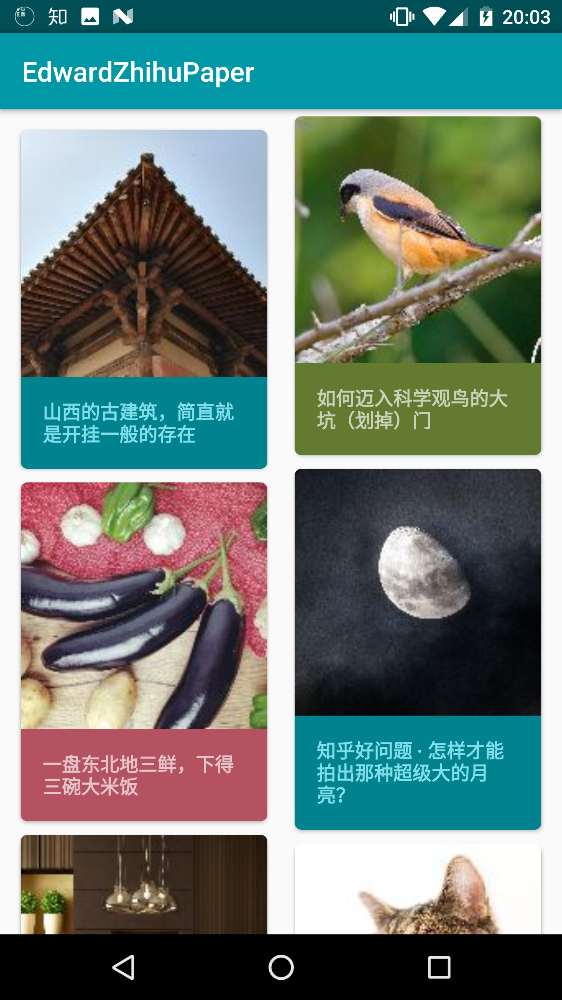
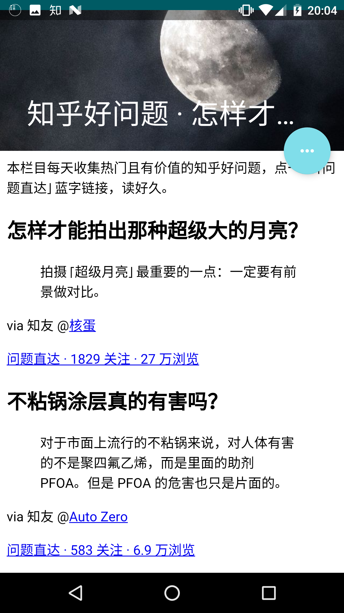
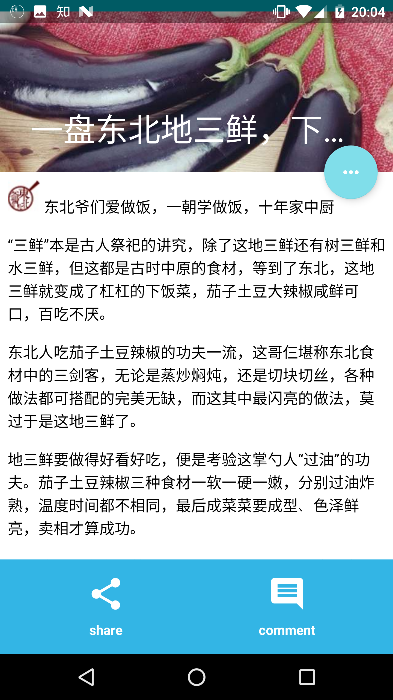
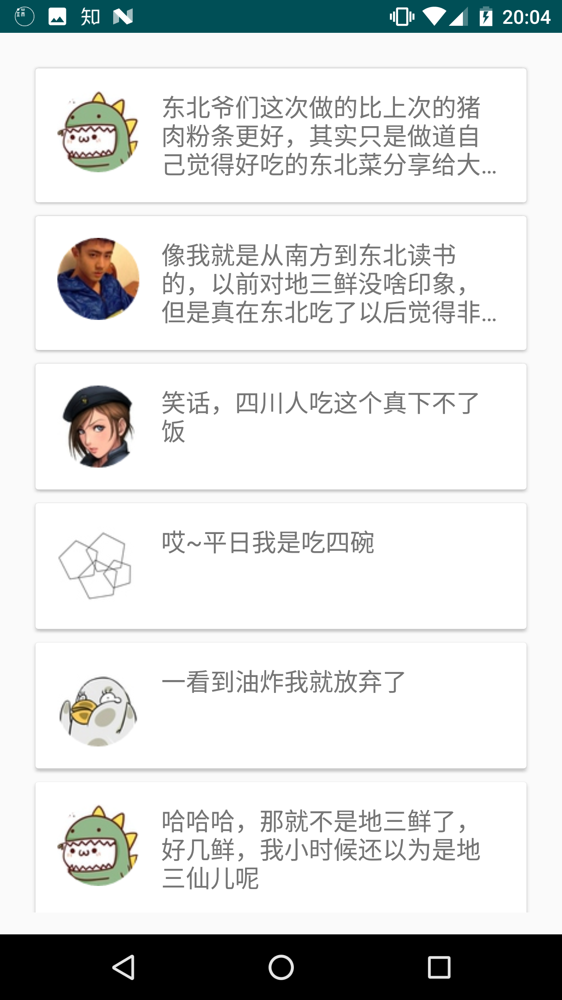
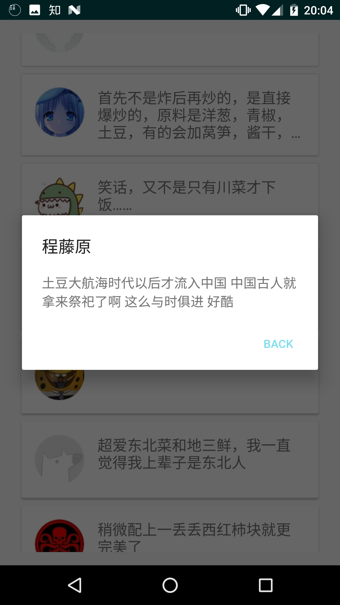

# EdwardZhihuDaily
Zhihu daily client made with RxJava, Retrofit, Dagger2,Realm in MVP architecture.

Some other features are also included:

- project modularization config in gradle
- app launch speed up in InitService
- activity transition animatino in BaseActivity
- general butterknife handling in BaseActivity
- three level (memory, disk, network) cache in MainActivity
- LinearSnapHelper in CommentActivity
- Contract Class in MVP
- RxBus
- Gson Deserializer in DailyStoriesDeserializer
- use CompositeSubscription in BaseCommonPresenter to handling rx related objects in case of memory leak
- ripple effect
- custom view (IconTextView)
- productFlavors and splits config in gradle

